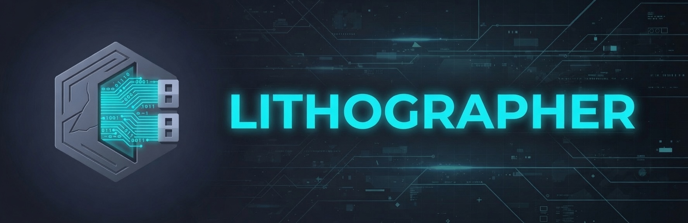

# Lithographer

<p align="center">
  
</p>

Desktop app for flashing disk images and cloning block devices. Built with [Tauri 2](https://tauri.app/) on top of the [litho](https://github.com/girish946/litho) engine.

Lithographer runs as a **normal user app**. Listing devices and checking safety rules happen in-process; actual flash/clone is done by a bundled **`litho` helper** after you approve elevation (polkit / UAC).

---

## What you can do

- **Flash** an image (`.img` / `.iso` / `.img.xz`) onto a USB drive or disk  
- **Clone** a whole disk to an image file  
- Pick devices and files with a simple UI  
- Optional **checksum verify** after flash  
- **Cancel** a running operation  
- **Light / dark** theme (preference is saved)

---

## Platforms

| OS | Status |
|----|--------|
| **Linux** | Full support (AppImage, `.deb`, `.rpm`) |
| **Windows** | Full support (MSI / NSIS) |
| **macOS** | Not fully supported yet |

---

## Install & run

### From a release build (Linux)

```bash
./lithographer_*_amd64.AppImage
# or install the .deb / .rpm from the release assets
```

On some Wayland setups the **AppImage** includes a compatibility hook. If WebKit misbehaves, try the **`.deb`** package (system WebKitGTK).

### From a release build (Windows)

Run the **MSI** or **NSIS** installer from the release, then start Lithographer from the Start menu.

### From source

You need:

- [Tauri 2 prerequisites](https://tauri.app/start/prerequisites/)
- A checkout of **litho** next to **lithographer** (same parent directory)
- Linux: `pkexec` (polkit) for elevation  
- Windows: WebView2 + ability to approve UAC

```bash
# Sibling layout:
#   …/litho
#   …/lithographer

cd lithographer
npm install
npm run tauri:build
```

Development (hot reload):

```bash
npm run tauri:dev
```

---

## How to use

1. Choose **Flash** or **Clone**.  
2. Select a **storage device** (removable drives are listed first).  
3. Choose the **image file** (flash) or **output path** (clone).  
4. Optionally enable **verify** for flash.  
5. Press **Start** and approve the elevation prompt if asked.  
6. Watch progress; use **Cancel** if you need to stop.

<p align="center">
  
</p>

### Elevation (what you’ll see)

| Platform | What happens |
|----------|----------------|
| **Linux** | System password dialog (`pkexec` / polkit) when flash or clone starts |
| **Windows** | UAC prompt; the app restarts elevated so progress still shows correctly |

You can also start the whole app elevated (`sudo` on Linux, “Run as administrator” on Windows) so per-operation prompts are not needed.

**Linux only — optional elevation backends** (advanced):

```bash
# Default: polkit / pkexec
./lithographer_*.AppImage

# Fallback if polkit is broken: sudo askpass
LITHOGRAPHER_ELEVATION=sudo ./lithographer_*.AppImage
```

---

## Safety

- **Wrong device = permanent data loss.** Read the device name carefully.  
- Prefer **USB / removable** media as flash targets.  
- Fixed (internal) disks require an extra confirmation.  
- Litho refuses the system disk and will unmount/dismount volumes on the target only after you confirm.

---

## Troubleshooting (users)

| Issue | What to try |
|-------|-------------|
| No devices listed | Re-plug the USB drive; refresh; on Linux ensure the kernel sees the disk (`lsblk`) |
| Elevation cancelled | Approve the password/UAC dialog, or run the app elevated |
| Flash fails mid-way | Close File Explorer / other disk tools; unmount the drive; retry |
| AppImage blank/broken on Wayland | Try the `.deb` package or an X11 session |
| Progress stuck after cancel | Wait for the current block to finish; cancel is cooperative |

Logs for the `litho` helper and TUI-related cache live under:

- Linux: `~/.cache/litho/`  
- Windows: `%LOCALAPPDATA%\litho\`

---

## For developers

Build system, architecture, sidecar preparation, CI, and protocol details:

→ **[docs/developer-docs.md](docs/developer-docs.md)**

Core engine and CLI:

→ **[litho](https://github.com/girish946/litho)** (see also [litho developer docs](https://github.com/girish946/litho/blob/main/docs/developer-docs.md))

## License

See `src-tauri/Cargo.toml`.
