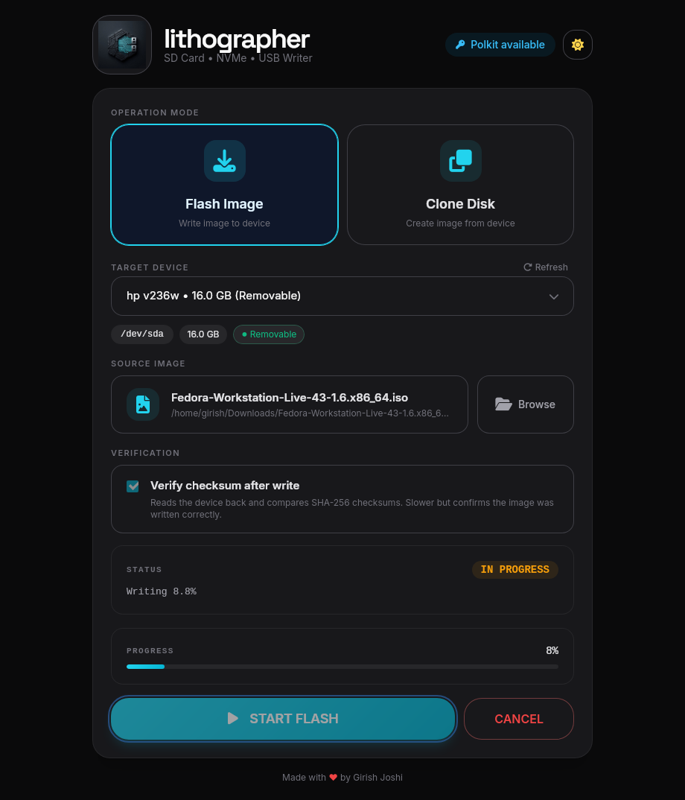

# Lithographer

GUI for [litho](https://github.com/girish946/litho) written in Rust using [tauri](https://tauri.studio/).


<p align="center">
</img>
</p>

## Build

### Prerequisites

As of now lithographer only supports building for Linux. You need to have the [Prerequisites for tauri](https://tauri.app/v1/guides/getting-started/prerequisites/) installed on the system.


Clone **lithographer** and its sibling dependency **litho** (required for `liblitho` and the bundled `litho` sidecar):

```bash
$ git clone https://github.com/girish946/lithographer.git
$ git clone --branch refactor-v1 https://github.com/girish946/litho.git
$ cd lithographer
$ npm install
$ npm run tauri:build
```

The repos must sit side by side (`…/litho` next to `…/lithographer`). GitHub Actions checks out `litho` the same way.

## Usage
```bash
$ ./src-tauri/target/release/bundle/appimage/lithographer_0.0.1_amd64.AppImage
```

</img>
